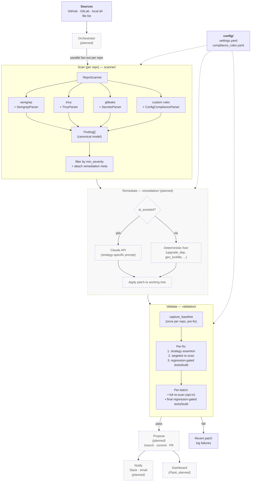
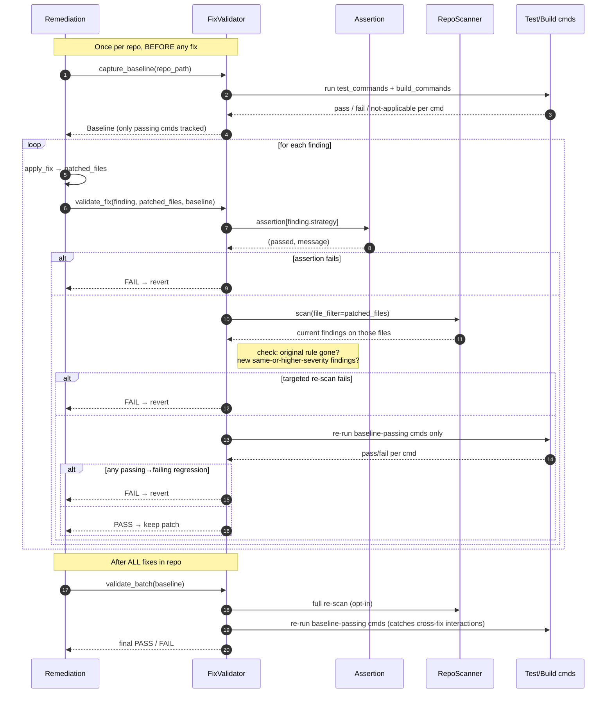

# Security Compliance AI

An AI-assisted security compliance scanner and auto-remediator for source code repositories. It runs a suite of third-party scanners plus custom pattern-based rules across one or many repos, normalizes the findings into a single model, and (once the remediation side is wired up) drafts fixes via the Anthropic Claude API and opens PRs for review.

## What this does

At a high level:

1. **Discover** repos from a configured source (GitHub org, GitLab group, local directory, or a newline-delimited list).
2. **Scan** each repo with the enabled tools:
   - `semgrep` — static analysis for code vulnerabilities (SQLi, XSS, deserialization, etc.)
   - `trivy` — filesystem scan for vulnerable dependencies.
   - `gitleaks` — git-history secret detection.
   - **Custom rules** — regex / file-presence checks defined in [config/compliance_rules.yaml](config/compliance_rules.yaml) for things the above tools don't cover well (Dockerfile hygiene, unpinned GitHub Actions, IaC misconfigs, missing `SECURITY.md` / `CODEOWNERS`, insecure TLS config, etc.).
3. **Normalize** every result into a canonical [`Finding`](scanner/finding.py) dataclass with severity, category, file/line location, and a stable `fingerprint` for dedup.
4. **Filter** by minimum severity and attach remediation metadata from the rule config (`strategy`, `ai_assisted`).
5. **Remediate** (planned) — for `ai_assisted: true` findings, ask Claude for a patch; for mechanical fixes (e.g. `upgrade_dependency`, `generate_lockfile`), run a deterministic fixer.
6. **Validate** — prove each fix actually fixes the issue AND doesn't break anything. Per-fix: a strategy-specific assertion (~ms) + a targeted re-scan of the patched files (seconds). Batch-level (optional): a full-repo re-scan. Test/build commands are regression-gated against a pre-fix baseline so pre-existing failures don't block fixes. See [Validation](#validation) below.
7. **Propose** (planned) — open a PR on a `security-fix/` branch, optionally notify Slack / email.
8. **Dashboard** (planned) — Flask + SocketIO UI at `http://localhost:8080` to browse findings across repos.

## Architecture

End-to-end pipeline. Solid boxes are implemented; dashed boxes are planned. Config files feed each stage.



## Repository layout

```
security-compliance-ai/
├── config/
│   ├── settings.yaml              # global config: AI model, repo discovery, scan/remediate/validate behavior
│   └── compliance_rules.yaml      # rule catalog: detection + remediation strategy per rule
├── scanner/
│   ├── finding.py                 # Finding dataclass + Severity enum (the canonical model)
│   ├── repo_scanner.py            # orchestrates semgrep/trivy/gitleaks/custom-rules per repo
│   └── parsers/                   # per-tool result parsers (not yet implemented)
├── orchestrator/                  # multi-repo fan-out (not yet implemented)
├── remediation/                   # Claude-assisted fix generation + PR creation (not yet implemented)
├── validation/
│   ├── validator.py               # FixValidator: per-fix + batch validation with regression gating
│   └── assertions.py              # strategy → positive-assertion map
├── dashboard/                     # Flask UI for findings (not yet implemented)
├── tests/                         # pytest suite (not yet implemented)
└── requirements.txt
```

## Current status

- [x] [`scanner/finding.py`](scanner/finding.py) — `Finding` + `Severity`
- [x] [`scanner/repo_scanner.py`](scanner/repo_scanner.py) — subprocess wrappers for semgrep/trivy/gitleaks + custom-rule dispatch; now tolerates missing parser modules (logs a warning and skips that tool) and accepts a `file_filter` for targeted re-scans
- [x] [`config/settings.yaml`](config/settings.yaml), [`config/compliance_rules.yaml`](config/compliance_rules.yaml)
- [x] [`validation/validator.py`](validation/validator.py), [`validation/assertions.py`](validation/assertions.py) — per-fix assertions, targeted re-scan, baseline-gated regression checks for the repo's existing tests/build
- [ ] `scanner/parsers/semgrep_parser.py`, `trivy_parser.py`, `secrets_parser.py`, `config_parser.py` — not yet written. `RepoScanner` now imports defensively, so it instantiates and runs, but each tool whose parser is missing is a no-op until the parser lands.
- [ ] orchestrator / remediation / dashboard / tests

In other words: scaffolding, rule catalog, the scanner's orchestration spine, and validation are in place; the tool-output parsers and everything in remediation / orchestration / UI still need to be built.

## Prerequisites

- **Python 3.10+** (the code uses `list[Finding]` / `dict` generics and `from __future__ import annotations`).
- **Anthropic API key** (for the remediation step, once implemented): `export ANTHROPIC_API_KEY=...`
- **External scanner binaries** on `PATH` — each is optional; if missing, that tool is skipped with a warning:
  - [`semgrep`](https://semgrep.dev/docs/getting-started/) — `pip install semgrep` (also in `requirements.txt`) or `brew install semgrep`
  - [`trivy`](https://aquasecurity.github.io/trivy/latest/getting-started/installation/) — `brew install trivy`
  - [`gitleaks`](https://github.com/gitleaks/gitleaks#installing) — `brew install gitleaks`

## Installation

```bash
cd /Users/chelsea_e/security-compliance-ai
python -m venv .venv
source .venv/bin/activate
pip install -r requirements.txt
```

## Configuration

Two YAML files control behavior:

- [config/settings.yaml](config/settings.yaml) — model, repo discovery, scan parallelism, min severity, remediation / validation / dashboard / notification settings. Edit `repos.source` and `repos.org` for your environment.
- [config/compliance_rules.yaml](config/compliance_rules.yaml) — the rule catalog. Each rule has an `id`, `severity`, `detection` (which tool + patterns/files), and `remediation` (`strategy` + whether it should be `ai_assisted`). Add or disable categories here without touching code.

## How to test

### 1. Sanity-check that the configs load

```bash
python -c "import yaml; print(len(yaml.safe_load(open('config/compliance_rules.yaml'))['categories']), 'categories')"
python -c "import yaml; yaml.safe_load(open('config/settings.yaml')); print('settings.yaml OK')"
```

Expected: `7 categories` and `settings.yaml OK`.

### 2. Exercise the `Finding` model

```bash
python - <<'PY'
from scanner.finding import Finding, Severity

f = Finding(
    rule_id="SEC001",
    rule_name="Hardcoded secrets in source",
    severity=Severity.CRITICAL,
    category="secrets",
    file_path="app/config.py",
    line_start=12,
    snippet='API_KEY = "sk-abcd1234..."',
    tool="gitleaks",
    repo="demo-repo",
)
print(f.to_json())
print("fingerprint:", f.fingerprint)

# Round-trip
f2 = Finding.from_dict(f.to_dict())
assert f2.fingerprint == f.fingerprint
print("round-trip OK")
PY
```

You should see the finding printed as JSON, a 16-char hex fingerprint, and `round-trip OK`. This confirms the canonical model works end-to-end.

### 3. Instantiate the scanner against a repo

`RepoScanner` now imports defensively — missing parsers are warned about and that tool is skipped, so this works today even though `scanner/parsers/` is empty. Every tool will simply no-op until the parsers land.

```bash
python - <<'PY'
import yaml, logging, tempfile
from scanner import RepoScanner

logging.basicConfig(level=logging.INFO)
settings = yaml.safe_load(open("config/settings.yaml"))
scanner = RepoScanner("config/compliance_rules.yaml", settings)

with tempfile.TemporaryDirectory() as tmp:
    findings = scanner.scan(tmp, repo_name="empty-repo")
    print(f"{len(findings)} findings (expect 0 — all parsers skipped)")
PY
```

Once the four parser modules (`semgrep_parser.py`, `trivy_parser.py`, `secrets_parser.py`, `config_parser.py`) are added under [scanner/parsers/](scanner/parsers/), the same call against a real repo will return actual findings.

Useful knobs in `config/settings.yaml` while testing:

- `scan.min_severity` — lower to `low` to see everything; raise to `critical` for noise-free runs.
- `scan.tools.*` — flip individual scanners off if you don't have the binary installed.

### 4. Exercise the validator (works today)

The validator is scanner-agnostic (it duck-types the `.scan(...)` method) and doesn't need parsers to be present to run assertion checks. The snippet below verifies a fix in isolation — no repo, no real parsers — by constructing a `Finding` and feeding a "good" and "bad" patched file into the assertion machinery:

```bash
python - <<'PY'
import tempfile, os, yaml, logging
from scanner import RepoScanner
from scanner.finding import Finding, Severity
from validation import FixValidator
from validation.assertions import get_assertion

logging.basicConfig(level=logging.INFO)
settings = yaml.safe_load(open("config/settings.yaml"))
scanner = RepoScanner("config/compliance_rules.yaml", settings)
validator = FixValidator(settings, scanner)

# A "good" patched file — secret externalized to env var
good = tempfile.NamedTemporaryFile("w", suffix=".py", delete=False)
good.write('import os\nAPI_KEY = os.environ["MY_API_KEY"]\n'); good.close()

# A "bad" patched file — secret still hardcoded (simulated bad fix)
bad = tempfile.NamedTemporaryFile("w", suffix=".py", delete=False)
bad.write('API_KEY = "sk-abcd1234efgh5678ijkl9012mnop3456"\n'); bad.close()

fn = get_assertion("replace_with_env_var")
print("good file:", fn([good.name], "/tmp"))
print("bad  file:", fn([bad.name],  "/tmp"))

os.unlink(good.name); os.unlink(bad.name)
PY
```

Expected:

```
good file: (True, 'secret externalized to env/vault reference')
bad  file: (False, '/var/folders/.../tmp.py: hardcoded secret pattern still present')
```

## Validation

**Goal: prove each fix actually fixes the issue, and nothing that was working before the fix is now broken.**



Three layers, cheapest first — so fast validation fails fast, and expensive validation only runs when earlier layers pass.

| Layer | What it checks | Cost | When |
|---|---|---|---|
| **Assertion** | Strategy-specific positive check on patched files (e.g. `replace_with_env_var` ⇒ no literal secret remains AND an env-var reference exists) | ms | per fix |
| **Targeted re-scan** | Re-runs `RepoScanner` filtered to the patched files. Fails if the original rule still fires, or if a *new* same-or-higher-severity finding shows up on those files | seconds | per fix |
| **Regression-gated tests/build** | Re-runs the repo's own `test_commands` / `build_commands`, but only the ones that were **passing** at baseline. Fails only on a passing → failing flip. Repeated at end of batch to catch cross-fix interactions | minutes | per fix + end of batch |
| **Full re-scan** (opt-in) | Scans the whole repo to catch cross-file regressions | minutes | once, end of batch |

### Why the baseline matters

Pre-existing test failures are common in real repos. If you just "run the tests after the fix and fail on any red test" you'll block every fix on any pre-existing red test — so people disable validation and you get nothing. The baseline approach (`validation.baseline_existing: true`) snapshots pass/fail *before* any fix, then only flags commands that regressed from passing to failing. Known-broken commands are logged and skipped.

Tradeoff: if a test was *already* broken pre-fix, validation won't catch a fix that breaks it differently. If that's a concern for your repo, set `baseline_existing: false` (strict mode) and fix your tests first.

### Config

[config/settings.yaml](config/settings.yaml) under `validation:`

| key | default | purpose |
|---|---|---|
| `run_tests` | `true` | execute `test_commands` |
| `verify_build` | `true` | execute `build_commands` |
| `verify_fixes` | `true` | assertion + targeted re-scan per fix |
| `full_rescan` | `false` | full-repo re-scan at end of batch (slow) |
| `baseline_existing` | `true` | only fail on passing → failing regressions |
| `timeout` | `300` | per-command timeout (seconds) |
| `step_budget_s` | `60` | log a warning if a single validation step exceeds this |

### Intended usage (once the remediation pipeline exists)

```python
scanner   = RepoScanner("config/compliance_rules.yaml", settings)
validator = FixValidator(settings, scanner)

baseline = validator.capture_baseline(repo_path)  # once per repo, BEFORE any fix

for finding in findings:
    patched_files = apply_fix(finding, repo_path)          # remediation code (not yet written)
    result = validator.validate_fix(repo_path, finding, patched_files, baseline)
    if not result.passed:
        revert_fix(finding, repo_path)
        log_failures(result.failures)

# After all fixes are applied and kept
final = validator.validate_batch(repo_path, baseline)
if not final.passed:
    abort_pr(final.failures)
```

### What the assertions cover

15 strategies have a registered positive assertion in [validation/assertions.py](validation/assertions.py): `replace_with_env_var`, `externalize_to_vault`, `add_non_root_user`, `pin_base_image`, `use_build_secrets`, `restrict_cidr`, `enable_encryption`, `make_private`, `enable_tls_verify`, `restrict_permissions`, `pin_action_sha`, `mask_secrets`, `generate_security_policy`, `generate_codeowners`, `generate_lockfile`.

Strategies with no cheap positive assertion (`parameterize_queries`, `sanitize_output`, `safe_deserialization`, `upgrade_dependency`, `pin_versions`, `enable_branch_protection`) rely on the targeted re-scan + existing tests instead — the assertion layer explicitly returns "no assertion registered" for these rather than pretending to check them.

### 5. Expected parser contracts (for whoever implements them next)

Each parser class needs a single method:

```python
class SomeParser:
    def parse(self, raw_stdout: str, repo_name: str) -> list[Finding]: ...
```

- `semgrep_parser.py` — consumes `semgrep scan --json` output, maps `extra.severity` + `check_id` → `Finding`.
- `trivy_parser.py` — consumes `trivy fs --format json` output, one `Finding` per vulnerability with `rule_id="DEP001"`.
- `secrets_parser.py` — consumes `gitleaks detect --report-format json`, maps to `rule_id="SEC001"`.
- `config_parser.py` — `ConfigComplianceParser(rules_dict).scan(repo_path, repo_name)` walks the tree and applies the `custom` / `api` rules defined in `compliance_rules.yaml` (regex match, anti-pattern absence, missing-file checks).

Once those exist, the scanner stage is self-contained and testable end-to-end.

## Safety notes

- The scanner itself only reads files and runs read-only scanner binaries — safe to point at any repo.
- The remediation stage (when built) defaults to `auto_apply: false` and `create_prs: true`, so nothing is ever merged without human review. Keep it that way unless you have strong validation coverage.
- Never set `validation.require_validation: false` in CI — unvalidated AI-generated patches should not auto-open PRs.

## Contributing / next steps

Suggested order of work:

1. Implement the four parsers under [scanner/parsers/](scanner/parsers/) so `RepoScanner.scan()` actually runs.
2. Add a `tests/` suite with fixtures of canned tool output to pin parser behavior.
3. Build `orchestrator/` to fan scanning out across many repos in parallel (`scan.parallelism`).
4. Build `remediation/` against the Claude API — prompt per `strategy`, patch application, branch + PR via `gitpython` / `gh`.
5. Push the `file_filter` optimization down into each parser so the targeted re-scan actually invokes the tools only on patched files (today it still runs the tools across the full repo and post-filters).
6. Stand up the Flask dashboard to browse findings + remediation status.
