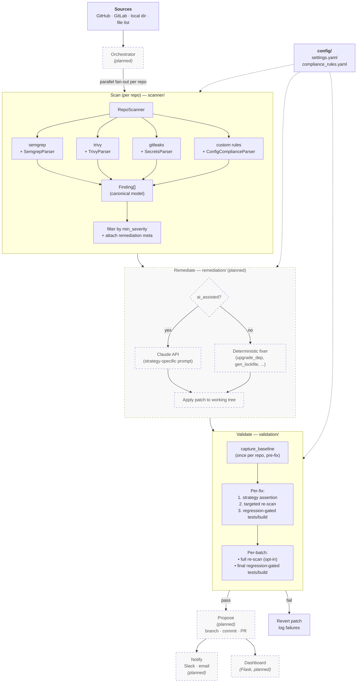

# Security Compliance AI

An AI-assisted security compliance scanner and auto-remediator for source code repositories. It runs a suite of third-party scanners plus custom pattern-based rules across one or many repos, normalizes the findings into a single model, and (once the remediation side is wired up) drafts fixes via the Anthropic Claude API and opens PRs for review.

## Author's Note
This was a live-build during a Yahoo technical interview. I used Claude as a pair-programming assistant to scaffold the validator service, then drove the architecture decisions, pushed back on design choices I didn't agree with and iterated until the parts I wanted worked end to end. Scanner and validator work today; parsers and remediation are listed still TODO (listed in Current Status below).


## What this does

At a high level:

1. **Discover** (planned) repos from a configured source (GitHub org, GitLab group, local directory, or a newline-delimited list).
2. **Scan** each repo with the enabled tools:
   - `semgrep` — static analysis for code vulnerabilities (SQLi, XSS, deserialization, etc.)
   - `trivy` — filesystem scan for vulnerable dependencies.
   - `gitleaks` — git-history secret detection.
   - **Custom rules** — regex / file-presence checks defined in [config/compliance_rules.yaml](config/compliance_rules.yaml) for things the above tools don't cover well (Dockerfile hygiene, unpinned GitHub Actions, IaC misconfigs, missing `SECURITY.md` / `CODEOWNERS`, insecure TLS config, etc.).
3. **Normalize** every result into a canonical [`Finding`](scanner/finding.py) dataclass with severity, category, file/line location, and a stable `fingerprint` for dedup.
4. **Filter** by minimum severity and attach remediation metadata from the rule config (`strategy`, `ai_assisted`).
5. **Remediate** (planned) — for `ai_assisted: true` findings, ask Claude for a patch; for mechanical fixes (e.g. `upgrade_dependency`, `generate_lockfile`), run a deterministic fixer.
6. **Validate** — prove each fix works and breaks nothing, cheapest checks first: a strategy assertion, a targeted re-scan, then the repo's own tests/build gated against a pre-fix baseline. See [Validation](#validation) for the layers and baseline rationale.
7. **Propose** (planned) — open a PR on a `security-fix/` branch, optionally notify Slack / email.
8. **Dashboard** (planned) — Flask + SocketIO UI at `http://localhost:8080` to browse findings across repos.

## Architecture

End-to-end pipeline. Solid boxes are implemented; dashed boxes are planned. Config files feed each stage.



## Repository layout

```
security-compliance-ai/
├── config/
│   ├── settings.yaml              # global config: AI model, repo discovery, scan/remediate/validate behavior
│   └── compliance_rules.yaml      # rule catalog: detection + remediation strategy per rule
├── scanner/
│   ├── finding.py                 # Finding dataclass + Severity enum (the canonical model)
│   ├── repo_scanner.py            # orchestrates semgrep/trivy/gitleaks/custom-rules per repo
│   └── parsers/                   # per-tool result parsers
├── orchestrator/                  # multi-repo fan-out
├── remediation/                   # Claude-assisted fix generation + PR creation
├── validation/
│   ├── validator.py               # FixValidator: per-fix + batch validation with regression gating
│   └── assertions.py              # strategy → positive-assertion map
├── dashboard/                     # Flask UI for findings
├── tests/                         # pytest suite
├── docs/                          # extended docs (validation reference)
└── requirements.txt
```

See [Current status](#current-status) for what's built vs. planned.

## Current status

- [x] [`scanner/finding.py`](scanner/finding.py) — `Finding` + `Severity`
- [x] [`scanner/repo_scanner.py`](scanner/repo_scanner.py) — subprocess wrappers for semgrep/trivy/gitleaks + custom-rule dispatch; tolerates missing parsers and accepts a `file_filter` for targeted re-scans
- [x] [`config/settings.yaml`](config/settings.yaml), [`config/compliance_rules.yaml`](config/compliance_rules.yaml)
- [x] [`validation/validator.py`](validation/validator.py), [`validation/assertions.py`](validation/assertions.py) — per-fix assertions, targeted re-scan, baseline-gated regression checks for the repo's existing tests/build
- [ ] the four parsers under `scanner/parsers/` (`semgrep_parser.py`, `trivy_parser.py`, `secrets_parser.py`, `config_parser.py`)
- [ ] orchestrator / remediation / dashboard / tests

`RepoScanner` imports parsers defensively, so it runs today — but any tool whose parser is missing is a no-op. Until the parsers land, the scanner instantiates and scans but returns nothing.

The pieces marked done above work, but have known rough edges — see [Known limitations](#known-limitations) before relying on them.

## Prerequisites

- **Python 3.10+** (the code uses `list[Finding]` / `dict` generics and `from __future__ import annotations`).
- **Anthropic API key** (for the remediation step, once implemented): `export ANTHROPIC_API_KEY=...`
- **External scanner binaries** on `PATH` — each is optional; if missing, that tool is skipped with a warning:
  - [`semgrep`](https://semgrep.dev/docs/getting-started/) — `pip install semgrep` (also in `requirements.txt`) or `brew install semgrep`
  - [`trivy`](https://aquasecurity.github.io/trivy/latest/getting-started/installation/) — `brew install trivy`
  - [`gitleaks`](https://github.com/gitleaks/gitleaks#installing) — `brew install gitleaks`

## Installation

```bash
cd path/to/security-compliance-ai
python -m venv .venv
source .venv/bin/activate
pip install -r requirements.txt
```

## Configuration

Two YAML files control behavior:

- [config/settings.yaml](config/settings.yaml) — model, repo discovery, scan parallelism, min severity, remediation / validation / dashboard / notification settings. Edit `repos.source` and `repos.org` for your environment.
- [config/compliance_rules.yaml](config/compliance_rules.yaml) — the rule catalog. Each rule has an `id`, `severity`, `detection` (which tool + patterns/files), and `remediation` (`strategy` + whether it should be `ai_assisted`). Add or disable categories here without touching code.

## Try it out

A few snippets to poke the working pieces by hand (there's no `pytest` suite yet — see [Current status](#current-status)).

### 1. Sanity-check that the configs load

```bash
python -c "import yaml; print(len(yaml.safe_load(open('config/compliance_rules.yaml'))['categories']), 'categories')"
python -c "import yaml; yaml.safe_load(open('config/settings.yaml')); print('settings.yaml OK')"
```

Expected: `7 categories` and `settings.yaml OK`.

### 2. Exercise the `Finding` model

```bash
python - <<'PY'
from scanner.finding import Finding, Severity

f = Finding(
    rule_id="SEC001",
    rule_name="Hardcoded secrets in source",
    severity=Severity.CRITICAL,
    category="secrets",
    file_path="app/config.py",
    line_start=12,
    snippet='API_KEY = "sk-abcd1234..."',
    tool="gitleaks",
    repo="demo-repo",
)
print(f.to_json())
print("fingerprint:", f.fingerprint)

# Round-trip
f2 = Finding.from_dict(f.to_dict())
assert f2.fingerprint == f.fingerprint
print("round-trip OK")
PY
```

You should see the finding printed as JSON, a 16-char hex fingerprint, and `round-trip OK`. This confirms the canonical model works end-to-end.

### 3. Instantiate the scanner against a repo

Works today against an empty `scanner/parsers/` — every tool no-ops, so you get 0 findings. Add the parsers and the same call returns real findings.

```bash
python - <<'PY'
import yaml, logging, tempfile
from scanner import RepoScanner

logging.basicConfig(level=logging.INFO)
settings = yaml.safe_load(open("config/settings.yaml"))
scanner = RepoScanner("config/compliance_rules.yaml", settings)

with tempfile.TemporaryDirectory() as tmp:
    findings = scanner.scan(tmp, repo_name="empty-repo")
    print(f"{len(findings)} findings (expect 0 — all parsers skipped)")
PY
```

Useful knobs in `config/settings.yaml` while testing:

- `scan.min_severity` — lower to `low` to see everything; raise to `critical` for noise-free runs.
- `scan.tools.*` — flip individual scanners off if you don't have the binary installed.

### 4. Exercise the validator (works today)

Verifies a fix in isolation — no repo, no parsers — by feeding a "good" and "bad" patched file into the assertion machinery:

```bash
python - <<'PY'
import tempfile, os, yaml, logging
from scanner import RepoScanner
from scanner.finding import Finding, Severity
from validation import FixValidator
from validation.assertions import get_assertion

logging.basicConfig(level=logging.INFO)
settings = yaml.safe_load(open("config/settings.yaml"))
scanner = RepoScanner("config/compliance_rules.yaml", settings)
validator = FixValidator(settings, scanner)

# A "good" patched file — secret externalized to env var
good = tempfile.NamedTemporaryFile("w", suffix=".py", delete=False)
good.write('import os\nAPI_KEY = os.environ["MY_API_KEY"]\n'); good.close()

# A "bad" patched file — secret still hardcoded (simulated bad fix)
bad = tempfile.NamedTemporaryFile("w", suffix=".py", delete=False)
bad.write('API_KEY = "sk-abcd1234efgh5678ijkl9012mnop3456"\n'); bad.close()

fn = get_assertion("replace_with_env_var")
print("good file:", fn([good.name], "/tmp"))
print("bad  file:", fn([bad.name],  "/tmp"))

os.unlink(good.name); os.unlink(bad.name)
PY
```

Expected:

```
good file: (True, 'secret externalized to env/vault reference')
bad  file: (False, '/var/folders/.../tmp.py: hardcoded secret pattern still present')
```

## Validation

**Goal: prove each fix actually fixes the issue, and nothing that was working before the fix is now broken.**

Three layers, cheapest first — so fast validation fails fast, and expensive validation only runs when earlier layers pass.

| Layer | What it checks | Cost | When |
|---|---|---|---|
| **Assertion** | Strategy-specific positive check on patched files (e.g. `replace_with_env_var` ⇒ no literal secret remains AND an env-var reference exists) | ms | per fix |
| **Targeted re-scan** | Re-runs `RepoScanner` filtered to the patched files. Fails if the original rule still fires, or if a *new* same-or-higher-severity finding shows up on those files | seconds | per fix |
| **Regression-gated tests/build** | Re-runs the repo's own `test_commands` / `build_commands`, but only the ones that were **passing** at baseline. Fails only on a passing → failing flip. Repeated at end of batch to catch cross-fix interactions | minutes | per fix + end of batch |
| **Full re-scan** (opt-in) | Scans the whole repo to catch cross-file regressions | minutes | once, end of batch |

The clever bit is the **baseline**: pre-existing test failures are common in real repos, so instead of failing on any red test, validation snapshots pass/fail *before* any fix and only flags commands that flip from passing to failing. This is what `validation.baseline_existing: true` does — and it's the source of one of the [Known limitations](#known-limitations).

**See [docs/VALIDATION.md](docs/VALIDATION.md)** for the full sequence diagram, the `validation:` config keys, intended usage once remediation exists, and the list of which strategies have positive assertions.

## Safety notes

- The scanner itself only reads files and runs read-only scanner binaries — safe to point at any repo.
- The remediation stage (when built) defaults to `auto_apply: false` and `create_prs: true`, so nothing is ever merged without human review. Keep it that way unless you have strong validation coverage.
- Never set `validation.require_validation: false` in CI — unvalidated AI-generated patches should not auto-open PRs.

## Known limitations

Known trade-offs in the current design, each with a path forward.

- **Targeted re-scan isn't actually targeted.** The `file_filter` just post-filters results, so every tool still scans the whole repo and throws away everything outside the patched files. Pushing the filter into each tool (`semgrep --include`, `trivy --skip-dirs`, etc.) would make it genuinely fast. Tracked as next-step #5 below.
- **`baseline_existing: true` hides regressions in already-broken tests.** It's the default and the right call while a repo has red tests (see [Why the baseline matters](docs/VALIDATION.md#why-the-baseline-matters)), but a fix that breaks an already-broken test in a new way slips through. Switch to `false` once the test suite is healthy.
- **No human-review gate before a branch is created.** Validation is fully automated — fine for mechanical fixes, riskier for AI-generated patches that can pass every check and still be wrong. There should be a human checkpoint before proposing AI-authored patches.
- **Dedup keys on a stable fingerprint, not file content.** Move a vulnerable line and the same issue looks "new" while the old spot looks fixed. A content hash would catch moved-but-identical findings. Worth revisiting.

## Parser contracts

The four parsers aren't written yet. Each is a class with a single method:

```python
class SomeParser:
    def parse(self, raw_stdout: str, repo_name: str) -> list[Finding]: ...
```

- `semgrep_parser.py` — consumes `semgrep scan --json`, maps `extra.severity` + `check_id` → `Finding`.
- `trivy_parser.py` — consumes `trivy fs --format json`, one `Finding` per vuln with `rule_id="DEP001"`.
- `secrets_parser.py` — consumes `gitleaks detect --report-format json`, maps to `rule_id="SEC001"`.
- `config_parser.py` — `ConfigComplianceParser(rules_dict).scan(repo_path, repo_name)` walks the tree and applies the `custom` / `api` rules from `compliance_rules.yaml` (regex match, anti-pattern absence, missing-file checks).

## Contributing / next steps

Suggested order of work:

1. Implement the four parsers under [scanner/parsers/](scanner/parsers/) so `RepoScanner.scan()` actually runs.
2. Add a `tests/` suite with fixtures of canned tool output to pin parser behavior.
3. Build `orchestrator/` to fan scanning out across many repos in parallel (`scan.parallelism`).
4. Build `remediation/` against the Claude API — prompt per `strategy`, patch application, branch + PR via `gitpython` / `gh`.
5. Push the `file_filter` optimization down into each parser so the targeted re-scan actually invokes the tools only on patched files (today it still runs the tools across the full repo and post-filters).
6. Stand up the Flask dashboard to browse findings + remediation status.
