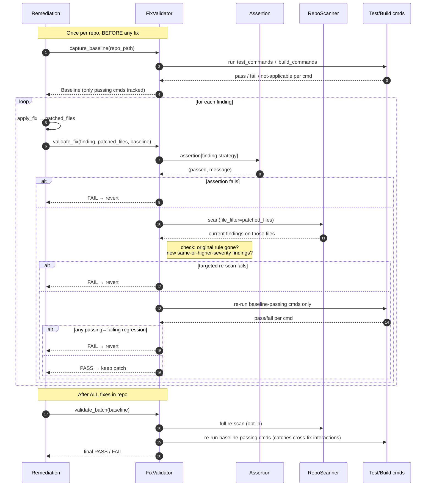

# Validation

Full reference for the validation stage. For the short version, see [Validation in the README](../README.md#validation).

**Goal: prove each fix actually fixes the issue, and nothing that was working before the fix is now broken.**

## Flow



## The three layers

Cheapest first — so fast validation fails fast, and expensive validation only runs when earlier layers pass.

| Layer | What it checks | Cost | When |
|---|---|---|---|
| **Assertion** | Strategy-specific positive check on patched files (e.g. `replace_with_env_var` ⇒ no literal secret remains AND an env-var reference exists) | ms | per fix |
| **Targeted re-scan** | Re-runs `RepoScanner` filtered to the patched files. Fails if the original rule still fires, or if a *new* same-or-higher-severity finding shows up on those files | seconds | per fix |
| **Regression-gated tests/build** | Re-runs the repo's own `test_commands` / `build_commands`, but only the ones that were **passing** at baseline. Fails only on a passing → failing flip. Repeated at end of batch to catch cross-fix interactions | minutes | per fix + end of batch |
| **Full re-scan** (opt-in) | Scans the whole repo to catch cross-file regressions | minutes | once, end of batch |

## Why the baseline matters

Pre-existing test failures are common in real repos. If you just "run the tests after the fix and fail on any red test" you'll block every fix on any pre-existing red test — so people disable validation and you get nothing. The baseline approach (`validation.baseline_existing: true`) snapshots pass/fail *before* any fix, then only flags commands that regressed from passing to failing. Known-broken commands are logged and skipped.

Tradeoff: if a test was *already* broken pre-fix, validation won't catch a fix that breaks it differently. If that's a concern for your repo, set `baseline_existing: false` (strict mode) and fix your tests first. (See [Known limitations](../README.md#known-limitations).)

## Config

Under `validation:` in [config/settings.yaml](../config/settings.yaml) — each key is also documented inline there.

| key | default | purpose |
|---|---|---|
| `run_tests` | `true` | execute `test_commands` |
| `verify_build` | `true` | execute `build_commands` |
| `verify_fixes` | `true` | assertion + targeted re-scan per fix |
| `full_rescan` | `false` | full-repo re-scan at end of batch (slow) |
| `baseline_existing` | `true` | only fail on passing → failing regressions |
| `timeout` | `300` | per-command timeout (seconds) |
| `step_budget_s` | `60` | log a warning if a single validation step exceeds this |

## Intended usage (once the remediation pipeline exists)

```python
scanner   = RepoScanner("config/compliance_rules.yaml", settings)
validator = FixValidator(settings, scanner)

baseline = validator.capture_baseline(repo_path)  # once per repo, BEFORE any fix

for finding in findings:
    patched_files = apply_fix(finding, repo_path)          # remediation code (not yet written)
    result = validator.validate_fix(repo_path, finding, patched_files, baseline)
    if not result.passed:
        revert_fix(finding, repo_path)
        log_failures(result.failures)

# After all fixes are applied and kept
final = validator.validate_batch(repo_path, baseline)
if not final.passed:
    abort_pr(final.failures)
```

## What the assertions cover

15 strategies have a registered positive assertion in [validation/assertions.py](../validation/assertions.py): `replace_with_env_var`, `externalize_to_vault`, `add_non_root_user`, `pin_base_image`, `use_build_secrets`, `restrict_cidr`, `enable_encryption`, `make_private`, `enable_tls_verify`, `restrict_permissions`, `pin_action_sha`, `mask_secrets`, `generate_security_policy`, `generate_codeowners`, `generate_lockfile`.

Strategies with no cheap positive assertion (`parameterize_queries`, `sanitize_output`, `safe_deserialization`, `upgrade_dependency`, `pin_versions`, `enable_branch_protection`) rely on the targeted re-scan + existing tests instead — the assertion layer explicitly returns "no assertion registered" for these rather than pretending to check them.
